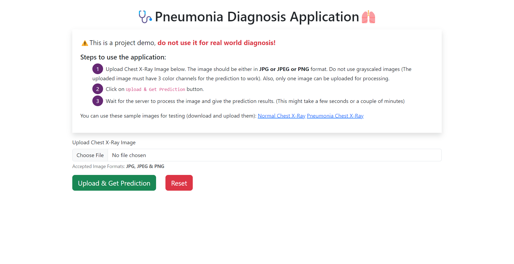
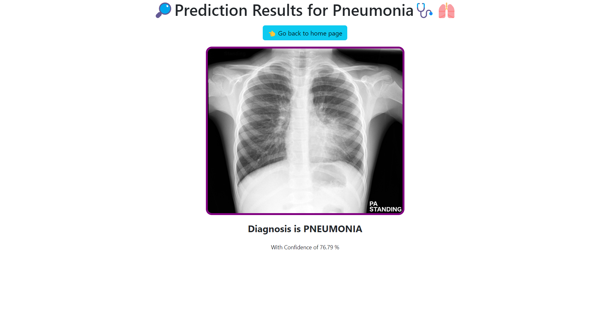
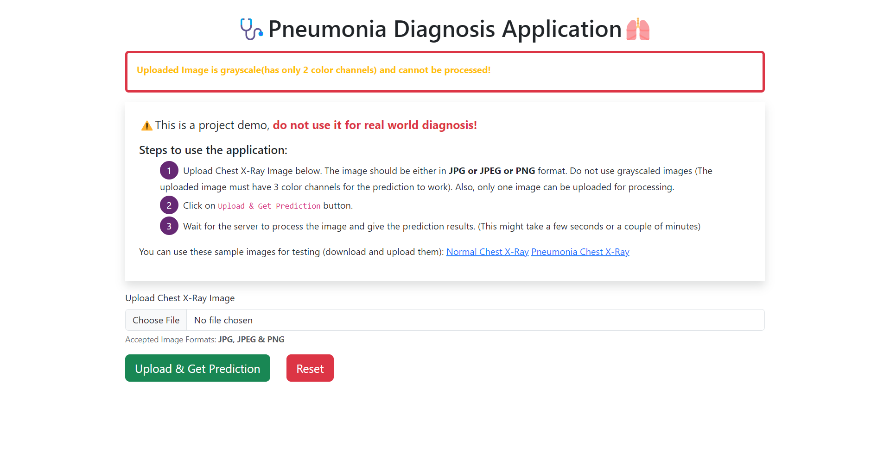

# 🩺Pneumonia Diagnosis from Chest X-Ray Images : an end-to-end application🫁

- I used [this](https://www.kaggle.com/datasets/tolgadincer/labeled-chest-xray-images) dataset from kaggle.
- First, I built a **custom CNN**.
- Later, I built several **Transfer Learning** (Feature Extraction + Fine Tuning) models using:
  - **VGG16**
  - **ResNet152V2**
- Out of the 5 model that I built, **ResNet152V2** model with feature extraction and a custom classifier gave the best accuracy of **89.7%**. (For the metrics of all models, please refer to `Summary.xlsx`)
- All the models were built using **TensorFlow**.
- I then used that best ResNet152V2 model for making inferences, by building a web application using **Flask** python framework, where a user can upload a chest x-ray image and get the diagnosis results.

> **⚠️NOTE:** The best ResNet152V2 saved model is very large, hence is not present in this repo. Download it from [here](https://drive.google.com/drive/folders/1fteRsc_pIHbu9K2zSAcLQgAbUqxIqcgb?usp=sharing) [Open this link and download the entire folder]. This file is required otherwise by the flask server to perform inferences.

## Description of files in the repo

➡️ `app.py` - **Flask** Server

➡️ `Pneumonia_Diagnosis_From_Chest_X_Rays_Final.ipynb` - IPython Notebook containing the code used to train various TensorFlow models.

➡️ `predict_result.py` - Script used to load the saved model and perform inference for an input image.

➡️ `requirements.txt` - Contains the python dependencies & the associated versions.

➡️ `Summary.xlsx` - Excel file containing the metrics (such as train|val|test loss|accuracy, precision, recall, etc) for the 5 models that I have built

➡️ `static` and `templates` - Flask uses these folder to serve static files, store uploaded images & render HTML pages.

## Steps to run the application

- Clone the repo.
- Download the model from the link given above.
- Make sure your folder structure is as follows:
```
resnet152v2_model_folder (Download it from above link)
static
templates
app.py
predict_result.py
requirements.txt
```
- Within this directory, install the dependencies using the command: **`pip install -r requirements.txt`**
- Within this directory, run the following command to start the server: **`flask --app app run`**
- Navigate to **`localhost:5000`** to access the web application.
- You can use the following images for testing: [Normal Chest X-Ray](https://prod-images-static.radiopaedia.org/images/220869/76052f7902246ff862f52f5d3cd9cd_jumbo.jpg) [Pneumonia Chest X-Ray](https://prod-images-static.radiopaedia.org/images/25074603/4994014ef5c834e4803541aa1dc874_jumbo.jpeg)

## Screenshots

#### Home Page:


#### Upload Normal Chest X-Ray image (before prediction):


#### Diagnosis Results for Normal Chest X-Ray:


#### Diagnosis Results for Pneumonia Chest X-Ray:


#### Error message for grayscale image:
(Some images which you download from the internet, or kaggle dataset are grayscale images and they do not contain 3 color channels. This model specifically required 3 color channels for inference.)

